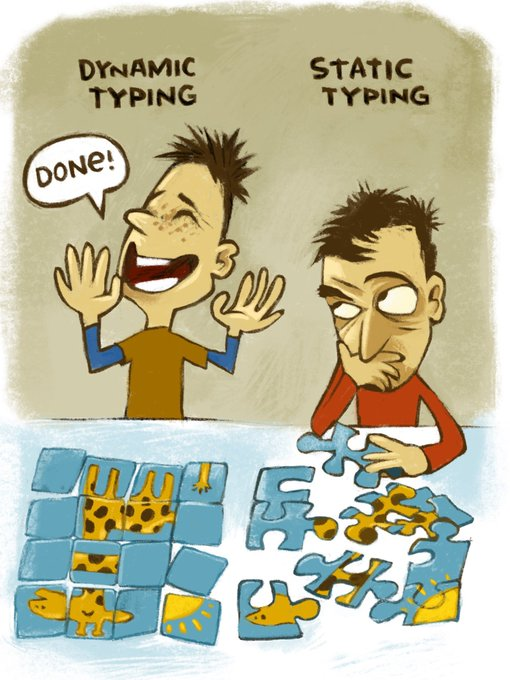

<div>
    
    <p> 
        Universidade Federal de Ouro Preto
        <br>
        Disciplina: BCC222 - Programação Funcional
        <br>
        Professor: Rodrigo Geraldo Ribeiro
    </p>
</div>
<hr />


### Primeiros passos

#### 1.0 - Desenvolvendo Haskell

##### 1.1 Configurando o ambiente

###### 1.2.1 Instalando diretamente em uma máquina

- Instale o [Haskell Stack](https://docs.haskellstack.org/en/stable/).

###### 1.2.2 Testando o setup de desenvolvimento em Haskell

- No terminal, acesse a pasta aula09 e execute os comandos:

``` bash 
stack build 

stack exec aula09-exe
```

se a execução acontecer com sucesso, sua máquina 
está devidamente configurada.

<hr/>

###### 1.3.1 Desenvolvendo num ambiente Vagrant

- Instale as ferramentas:
    - [Vagrant](https://www.vagrantup.com/)
    - [VirtualBox](https://www.virtualbox.org/)

<details>
    <summary> Vagrantfile </summary>

``` bash

# -*- mode: ruby -*-
# vi: set ft=ruby :

Vagrant.configure("2") do |config|
  config.vm.box = "archlinux/archlinux"

  config.vm.provider "virtualbox" do |vb|
    vb.memory = "8048"
    vb.cpus = 4
  end

  config.vm.provision "shell", inline: <<-SHELL
    # Update the system
    sudo pacman -Syu --noconfirm

    # Install necessary packages
    sudo pacman -S --noconfirm base-devel git ghc cabal-install stack emacs

    # Set up Emacs for TTY mode
    echo "(setq inhibit-startup-message t)" >> /etc/skel/.emacs
    echo "(menu-bar-mode -1)" >> /etc/skel/.emacs
    echo "(tool-bar-mode -1)" >> /etc/skel/.emacs
    echo "(scroll-bar-mode -1)" >> /etc/skel/.emacs
    echo "(setq visible-bell t)" >> /etc/skel/.emacs
    echo "(setq ring-bell-function 'ignore)" >> /etc/skel/.emacs

    # Set up Haskell enviroment 
    cabal update
    stack setup

  SHELL

  config.vm.provision "shell", path: "build-and-run.sh"

end


```

</details>

<details>
    <summary> build-and-run.sh </summary>

``` bash

#!/bin/bash

# Test Haskell environment
cd /vagrant/aula09
sudo -u vagrant stack exec aula09-exe

if [ ! -d "/vagrant/slides" ]; then
    mkdir /vagrant/slides
fi

# Clone org-reveal repository
if [ ! -d "/home/vagrant/.emacs.d/org-reveal" ]; then
git clone https://github.com/yjwen/org-reveal.git /home/vagrant/.emacs.d/org-reveal
fi

# Set up Emacs for org-reveal
sudo -u vagrant echo "(add-to-list 'load-path (expand-file-name \"org-reveal\" \"~/.emacs.d\"))" >> /home/vagrant/.emacs
sudo -u vagrant echo "(require 'ox-reveal)" >> /home/vagrant/.emacs

# Install org-reveal package
sudo -u vagrant emacs --batch -l /home/vagrant/.emacs -eval '(load-library "ox-reveal")'

# Define function to export slides
echo "(defun export-slides (file) (find-file file) (org-reveal-export-to-html))" >> /home/vagrant/export.el

# Create reveal presentation
for dir in /vagrant/aula* /vagrant/extra*; do
  if [ -d "$dir" ]; then
    for file in "$dir"/*.org; do
      if [ -f "$file" ]; then
        sudo -u vagrant emacs --batch -l /home/vagrant/.emacs -l /home/vagrant/export.el --eval "(export-slides \"$file\")" 
        mv "${file%.org}.html" /vagrant/slides/
      fi
    done
  fi
done


```

</details>

- Em uma maquina com vagrant instalado, execute:

``` bash

- vagrant up --provision-with shell

```

Esse comando ira instanciar uma máquina virtual com 
Haskell e Emacs, além de executar o teste da Aula09
e gerar todos os slides das aulas em uma pasta /slide.

Agora basta conectar-se ao ambiente virtual para 
começar a desenvolver em Haskell utilizando 
[Emacs](https://www.gnu.org/software/emacs/) ou 
[Vim](https://neovim.io/).

<hr />

<div align="center" >
    

**Happy hacking!**

</div>
